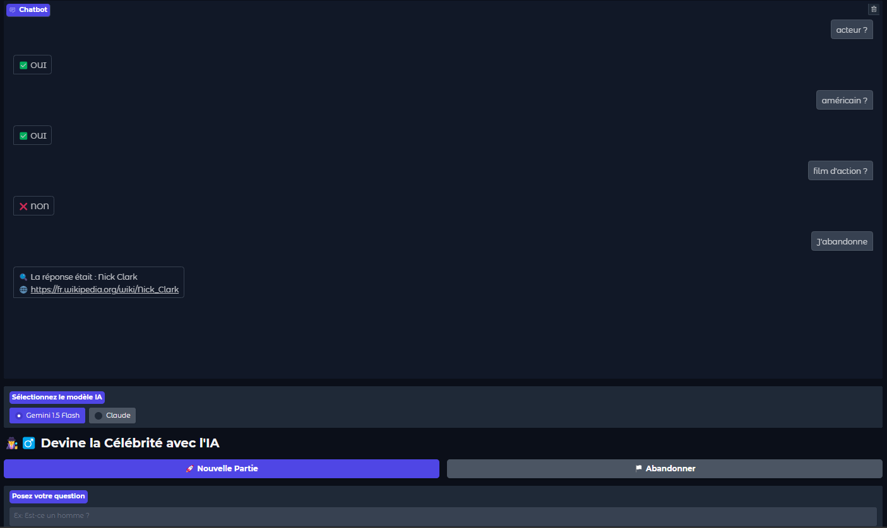

# 🎭 Devine la Célébrité avec l'IA

Ce projet est un jeu interactif où l'utilisateur doit deviner une célébrité en posant des questions à une intelligence artificielle (IA). L'IA répond uniquement par "oui", "non" ou "je ne sais pas" en se basant sur des informations récupérées depuis **Wikipedia**. L'interface utilisateur est construite avec **Gradio**.

---

## 🚀 Fonctionnalités

- 🎭 **Choix aléatoire d'une célébrité** issue d'une catégorie Wikipedia.
- 🤖 **Réponses basées sur l'IA** (Gemini ou Claude).
- 🎤 **Interface interactive avec Gradio**.
- 🏳️ **Option pour abandonner et révéler la réponse**.

---

## 🛠️ Installation et exécution

### 1️⃣ Cloner le projet
```sh
git clone https://github.com/ton-repo/celeb-game.git
cd celeb-game
```

### 2️⃣ Installer les dépendances
Assurez-vous d'avoir **Python 3.8+** et pip installé, puis exécutez :
```sh
pip install -r requirements.txt
```

### 3️⃣ Configurer les variables d'environnement
Créez un fichier `.env` à la racine du projet et ajoutez votre clé API :
```ini
GEMINI_API_KEY=your_google_gemini_api_key
```

### 4️⃣ Lancer l'application
```sh
python app.py
```
Le jeu s'ouvrira dans votre navigateur.

---

## 🏗️ Technologies utilisées

- **Python** (3.8+)
- **Gradio** (interface utilisateur)
- **Wikipedia API** (recherche d'informations)
- **Google Gemini API** (modèle d'IA pour répondre aux questions)

---

## 📸 Capture d'écran



---

## 📜 Licence
Ce projet est sous licence MIT - voir le fichier [LICENSE](LICENSE) pour plus de détails.

---

## 📬 Contact
Si vous avez des questions ou des suggestions, contactez-moi sur GitHub ou via email.

👨‍💻 **Auteur :** Racim ZENATI

